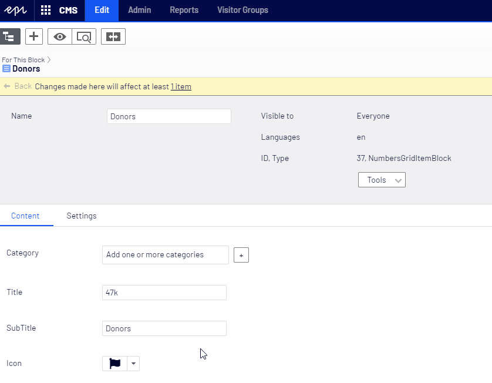

[](https://nuget.episerver.com/package/?id=EPiServer.CMS.UI.Core&v=11.1.0)

# Icon Selection Editor for EPiServer.

Module which extends EPiServer edit mode by adding possibility to select icons (i.e. [Font Awesome](https://fontawesome.com/), [Materialize](https://materializecss.com/), [CSS.gg](https://css.gg/) etc.) using dropdown.



## How to create and use IconSelectionEditor.

1. Create model class which will represent icon:
```csharp
public class CustomIconSelectItem : IconSelectItem
{
    public override string ToHtmlString()
    {
        (...)
    }
}
```

Here we can specify:
- ```Id```: Unique id of an icon - this value will be stored in DB.
- ```Name```: Friendly name which can be used during filtering.
- ```KeyWords```: Keyword which can be used during filtering.

2. Create IconSelectionFactory which will return all available icons:
```csharp
public class CustomIconSelectionFactory : IconSelectionFactory
{
    public override IEnumerable<IconSelectItem> GetIcons(ExtendedMetadata metadata)
    {
        (...)
    }
}
```

3. Create property attribute:
```csharp
public class SelectCustomIconAttribute : SelectIconAttribute
{
    public SelectCustomIconAttribute()
    {
        this.SelectionFactoryType = typeof(CustomIconSelectionFactory);
        this.IconsPerRow = 5;
    }
}
```

Here we can specify:
- ```IconsPerRow```: how many icons should be displayed in a row.
- ```RequireClientResources```: additional resources which should be loaded with widget (i.e. css with icons).
- ```Filterable```: possibility to filter icons by name or keywords.
- ```SelectionFactoryType```: Our factory created in 2.

4. Decorate EPiServer content model property using created custom attribute:
```csharp
[ContentType(DisplayName = "Custom Content Block", GUID = "d1216b39-21ce-4873-a8c1-c3d5db2b9285")]
public class CustomContentBlock : BlockData
{
    [SelectCustomIcon]
    public virtual string Icon { get; set; }
}
```
